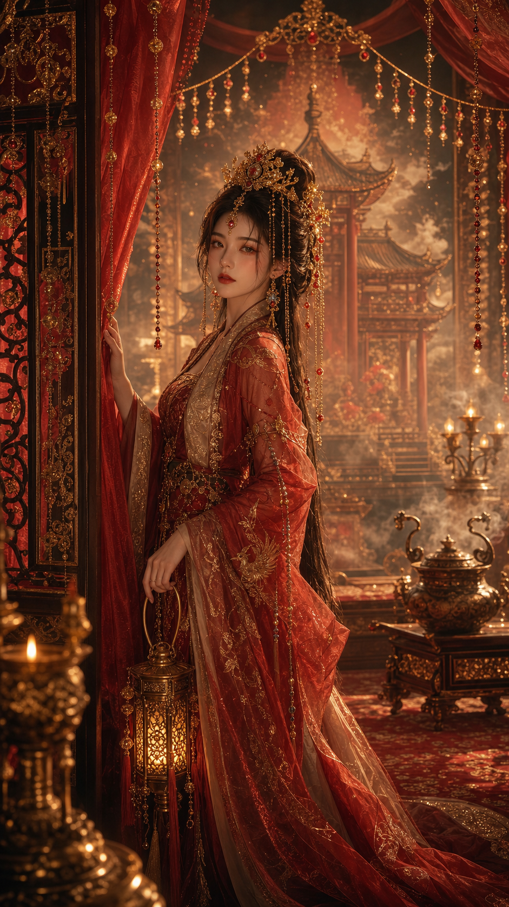
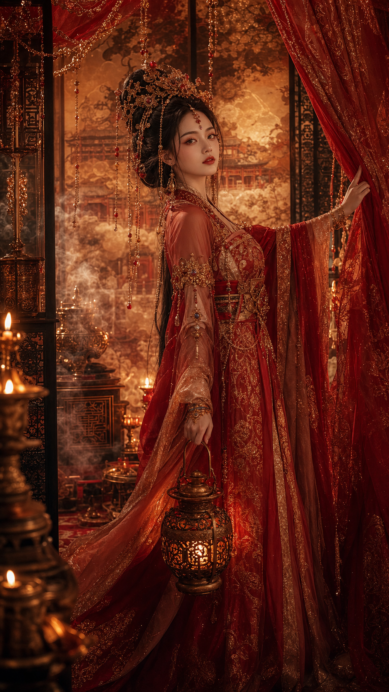
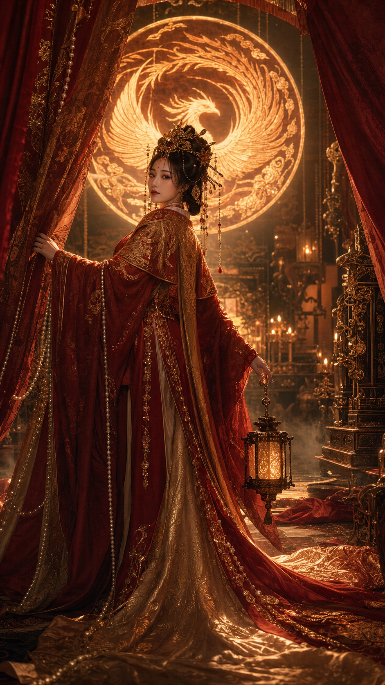
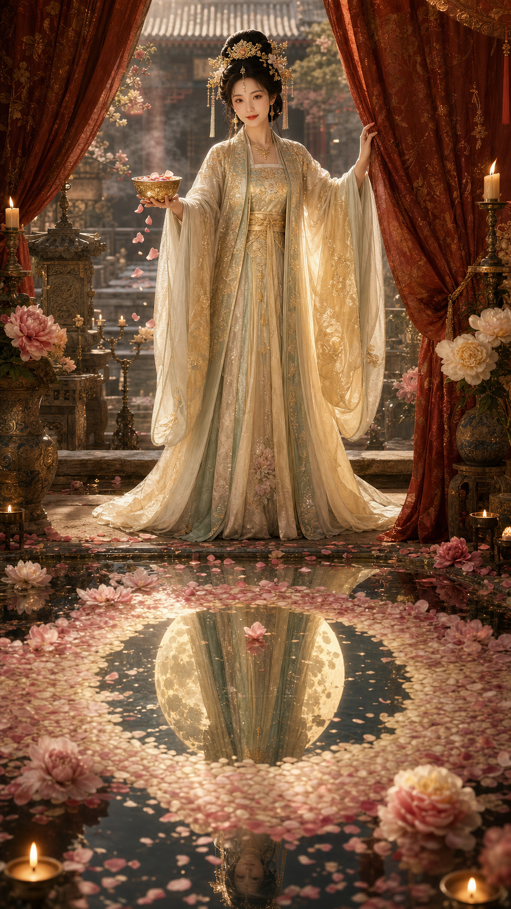
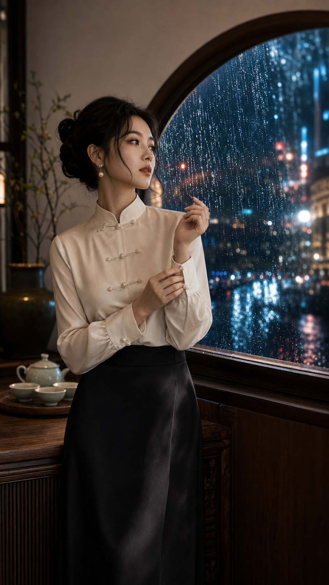
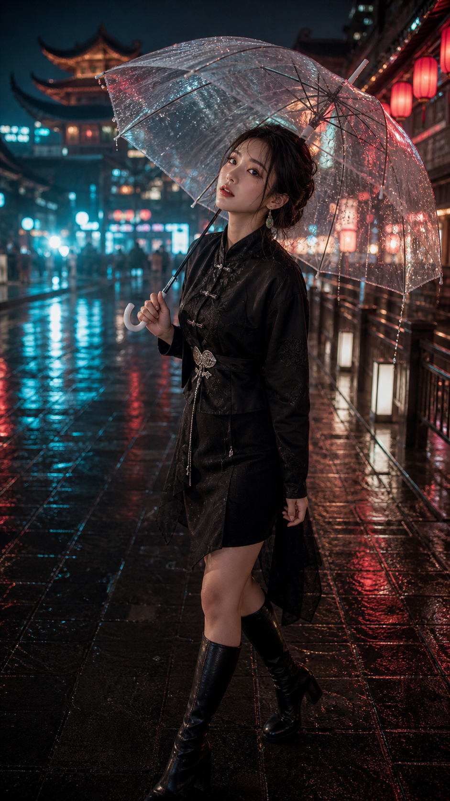
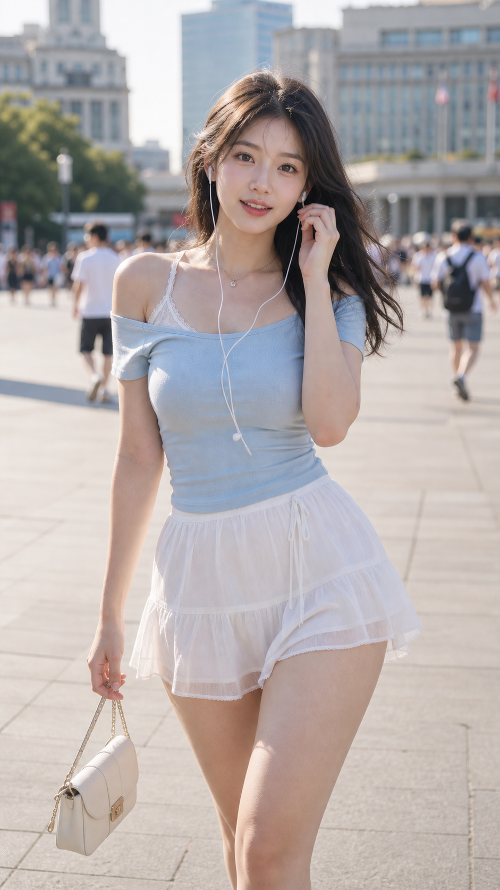

# Eastern Beauty Director

一个面向 Codex 的「东方美人系列」AI 绘画提示词 Skill。它的长期方向不只限于古风，也可以扩展到写实东方美人、现代东方审美、国风时尚、古风人物、东方幻想角色等方向。

当前版本重点覆盖古风与东方幻想，也开始支持写实东方美人、现代东方审美、新中式杂志人像、甜系纯欲生活写真（兼容 SweetHomeGirl 调用）等方向。它会把「古风美女」「国风人物」「仙侠女主」「敦煌飞天」「龙女」「浴后美人」「新中式东方高级感」「甜美女友感居家写真」这类简单需求，扩写成更有导演感、更适合 Midjourney、Stable Diffusion、ComfyUI、DALL-E、GPT image、Gemini、Seedream 等工具使用的提示词。

新增支持「东方美学图鉴」内容系统，适合持续生产四大美人、四大才女、十二花神、东方神女、敦煌飞天、朝代服饰、东方器物、东方神话等 3:4 小红书图鉴封面和正文页。

## 1. 适合谁用

- 你想生成东方美人、古风美女、东方幻想角色、国风人物主视觉。
- 你觉得普通提示词太像「漂亮女人 + 汉服 + 背景」，想要更有故事、更惊艳。
- 你需要一组角色设定、系列主题、提示词包，或者小程序里的提示词标签。
- 你需要一个真实、自然、有故事感，同时保留女性魅力的 SweetHomeGirl 系列。
- 你是新手，不知道怎么把想法写成专业 AI 绘画 prompt。

## 2. 安装方法

把这个仓库放到 Codex 的 skills 目录下即可。

### 2.1 直接克隆

```bash
cd ~/.codex/skills
git clone https://github.com/<your-name>/codex-skill-eastern-beauty-director.git
```

Windows 用户如果你的 Codex skills 目录在 `C:\Users\<你的用户名>\.codex\skills`，可以把仓库克隆或复制到：

```text
C:\Users\<你的用户名>\.codex\skills\codex-skill-eastern-beauty-director
```

### 2.2 手动下载

1. 在 GitHub 页面点击 `Code`。
2. 点击 `Download ZIP`。
3. 解压后，把文件夹改名为 `codex-skill-eastern-beauty-director`。
4. 放到你的 Codex skills 目录：

```text
~/.codex/skills/codex-skill-eastern-beauty-director
```

重启 Codex 后，它会自动发现这个 skill。

## 3. 怎么使用

在 Codex 里直接提需求即可，不需要手动打开 `SKILL.md`。

### 3.1 通用调用示例

小白用户推荐直接填写结构化参数，不需要阅读示例文档：

```text
技能: 东方美人

风格:
气质:
场景:
服装:
动作:
构图:
生成:
```

例如：

```text
技能: 古典东方美人

风格: 宋韵茶影
气质: 温婉优雅
场景: 雨天茶室
服装: 宋式浅色交领长衫
动作: 端起茶杯前抬眼
构图: 大腿以上
生成: 是
```

Codex 会自动补全路线、光线、镜头、氛围、负面词和完整 Prompt；如果 `生成: 是`，会继续生图。

也可以直接这样说：

```text
帮我写一个东方美人系列主视觉提示词，目前偏古风和东方幻想
```

```text
帮我写一个敦煌飞天古风美女的 Midjourney 提示词，要惊艳一点
```

```text
优化这个提示词：古风美女，红衣，凤凰，宫殿，电影感
```

```text
做一组东方幻想国风美女系列，6 个角色，每个角色要有不同视觉钩子
```

```text
给我一个浴后美人的古风提示词，纯欲但不要暴露，适合 SD
```

```text
用 甜系纯欲生活写真 写一张9:16，人脸风格氧气少女，书店，翻书时抬头，大腿以上构图
```

```text
我要做小程序提示词生成器，帮我拆成主题、人物、服饰、场景、光影、镜头、负面词
```

### 3.2 甜系纯欲生活写真 / SweetHomeGirl

`技能` 可以写 `甜系纯欲生活写真`，也可以写 `SweetHomeGirl`。这个风格适合生成真实、自然、有故事感，同时保留女性魅力和恋爱感的年轻都市女性生活写真。它的核心不是固定同一张脸，而是固定审美体系：真实感、女性魅力、恋爱感、故事瞬间和自然吸引力。

推荐先用轻量参数调用：

```text
技能: 甜系纯欲生活写真

人脸风格:
场景:
穿搭:
故事瞬间:
构图:
```

可选参数在需要时再填写：

```text
天气:
时间:
镜头要求:
```

如果需要严格控制服装单品，也可以额外使用：

```text
穿搭细节:
  上装:
  下装:
  鞋袜:
  配饰:
```

#### 3.2.1 轻量示例

```text
技能: 甜系纯欲生活写真

人脸风格: 邻家女孩
场景: 自助洗衣房
穿搭: 宽松白T，牛仔短裙，帆布鞋
故事瞬间: 她正把衣服从烘干机里抱出来，发现你在门口等她，忍不住笑了一下
构图: 9比16，上半身
时间: 夜晚
```

#### 3.2.2 精控示例

```text
技能: SweetHomeGirl

人脸风格: 甜系美女
场景: 人民广场
穿搭: 都市夏日甜系街拍
穿搭细节:
  上装: 浅蓝色棉质露肩短袖，蕾丝内搭
  下装: 白色轻盈短裙
  鞋袜: 浅色低跟凉鞋
  配饰: 精致小包，耳机
故事瞬间: 迎面向我走来，不经意浅笑
构图: 大腿以上
天气: 晴天
```

更多 SweetHomeGirl 示例：

- [`甜系纯欲生活写真-推荐调用格式.md`](examples/甜系纯欲生活写真-推荐调用格式.md)
- [`甜系纯欲生活写真-默认示例.md`](examples/甜系纯欲生活写真-默认示例.md)
- [`甜系纯欲生活写真-人民广场.md`](examples/甜系纯欲生活写真-人民广场.md)

### 3.3 东方美学图鉴

适合做小红书图鉴、文化专题封面、人物总览页、人物页、时间轴页和对比页。这个路线默认使用 `3:4` / `1080x1440`，不走全局 `9:16`。

推荐继续使用和其它路线一致的中文结构化字段：

```text
技能: 东方美学图鉴

页面类型: 人物页
人物: 卓文君
朝代: 西汉
身份标签: 西汉才女
标签:
  - 爱情
  - 辞赋
  - 独立
引文: 愿得一人心，白首不相离
服装: 浅杏色汉代曲裾
动作: 手持团扇
主题元素: 海棠
配色: 米白+浅杏+香槟金
生成: 是
```

也支持 Codex-friendly 的英文别名字段：

```text
技能: 东方美学图鉴

Type: Character
Name: 卓文君
Dynasty: 西汉
Identity: 西汉才女
Tags:
  - 爱情
  - 辞赋
  - 独立
Quote: 愿得一人心，白首不相离
Costume: 浅杏色汉代曲裾
Action: 手持团扇
MainElement: 海棠
Color: 米白+浅杏+香槟金
生成: 是
```

封面示例：

```text
技能: 东方美学图鉴

页面类型: 封面
期数: 09
主标题: 四大才女
副标题: 蔡文姬·卓文君·李清照·上官婉儿
主题元素: 古籍
配色: 米白＋浅青＋香槟金
人物: 四位东方才女群像
生成: 是
```

人物页示例：

```text
技能: 东方美学图鉴

页面类型: 人物页
人物: 李清照
身份标签: 千古词宗
主题元素: 海棠
内容: 人物简介、代表作品、关键词、文化意义
配色: 米白＋胭脂粉＋香槟金
生成: 是
```

## 4. 它会输出什么

通常会包含：

- 参数锁定：保留你明确说过的主题、风格、比例、平台等。
- 导演设定：说明画面的角色身份、故事瞬间和视觉重点。
- 中文主提示词：适合直接复制到中文提示词工具。
- English prompt：适合 Midjourney / SD 风格工具。
- 负面提示词：避免低质量、坏手、廉价 cosplay、现代物品、文字水印等问题。
- 参数建议：比如画幅比例、风格强度等。

## 5. 内置风格路线

当前版本主要包含这些古风 / 东方幻想路线：

- 天象神朝：星象、观星台、神官、命盘。
- 昆仑雪剑：雪山、剑姬、守桥、清冷。
- 敦煌壁画神女：飞天、壁画、矿物色、沙漠神秘感。
- 沧海龙庭：龙女、海潮、珍珠、水下宫殿。
- 莲梦镇邪：莲灯、梦境、符箓、镜湖。
- 凤阙宫火：凤凰、宫廷、红金、女王感。
- 月宫炼华：月宫、桂树、银炉、炼丹。
- 青铜神谕城：青铜器、甲骨、古城、祭司、战争预言。
- 雾浴私语：成年浴后、湿发、水汽、私房氛围，保持克制与安全。

也开始支持更完整的东方美人审美光谱：

- 柔美：水光、花影、温柔眼神、柔纱和低对比光。
- 妩媚：回眸、眼波、珠光、烛火、成熟克制的姿态。
- 成熟：深色衣料、从容表情、珠宝、暗光和控制感。
- 优雅：长线条、留白、端正肩颈、丝绸、玉饰。
- 高贵：仪式感、冠饰、宫廷轴线、正面凝视、金属光。
- 清冷、温婉、英气、神性、慵懒等气质也可以作为上层审美方向。

新增的古典东方美人路线包括：

- 洛神水镜：水边神女、柔美、神性、流动感。
- 宋韵茶影：宋式极简、茶室、温婉、优雅。
- 唐宫夜宴：盛唐华贵、成熟、妩媚、宫廷烛光。
- 江南烟雨：雨窗、油纸伞、白墙黑瓦、温柔文气。
- 青瓷月影：青瓷、月白、冷玉感、清冷高贵。
- 昆曲花影：戏曲身段、花窗、眼波、含蓄妩媚。
- 竹林清谈、胭脂雪、玉楼春睡等古典审美方向。

### 5.1 精选图片展示

`images/` 目录只保留可复用的风格样张，不保存每日自动化归档。每个风格方向原则上最多保留两张代表图；如果 daily 任务里出现特别出彩的图片，再手动提升到对应风格目录和 README。

| 风格方向 | 代表图 |
| --- | --- |
| 东方幻想古风 |   |
| 凤阙宫火 |   |
| 古典东方美人 |   |
| 新中式杂志 |   |
| 现代东方美人 |   |
| 甜系纯欲生活写真 |   |

## 6. 未来方向

这个 skill 的定位可以逐步从「古风美女」升级为更完整的「东方美人系列」：

- 写实东方美人：肖像摄影、电影感写真、杂志封面、自然皮肤质感。
- 现代东方审美：新中式、国风时尚、东方高级感妆造、现代茶室、江南雨窗、杂志大片。
- SweetHomeGirl：真实感 + 女性魅力 + 恋爱感 + 故事瞬间 + 自然纯欲，不锁定单一人脸，场景只作为舞台。
- 古风人物：汉服、宫廷、江南、武侠、宋韵、唐风等。
- 东方幻想：仙侠、神话角色、神官、龙女、敦煌、月宫、青铜古城等。

当前推荐仓库名使用 `codex-skill-eastern-beauty-director`，Skill 内部名称使用 `eastern-beauty-director`。这个命名表达长期方向是东方美人系列的执行导演；当前内容先稳定古风与东方幻想能力，后续可以继续扩展写实东方美人、现代东方审美和新中式方向。

## 7. 示例文件

可以查看 `examples/` 目录，里面有完整可复制的示例提示词：

- `天象神朝-星图神官.md`
- `昆仑雪剑-守桥剑姬.md`
- `敦煌壁画-神谕飞天.md`
- `沧海龙庭-潮汐龙女.md`
- `莲梦镇邪-莲灯灵使.md`
- `凤阙宫火-凤凰女王.md`
- `绮罗金帐-宫廷秘仪.md`
- `绮罗金帐-妩媚高贵.md`
- `月宫炼华-月镜炼丹师.md`
- `青铜神谕城-甲骨战巫.md`
- `雾浴私语-浴后美人.md`
- `新中式杂志-雨窗美人.md`
- `宋韵茶影-温婉优雅.md`
- `唐宫夜宴-成熟妩媚.md`
- `唐宫花泉仪式-高贵柔美.md`
- `东方珠宝大片-高贵成熟.md`
- `甜系纯欲生活写真-默认示例.md`
- `甜系纯欲生活写真-推荐调用格式.md`
- `甜系纯欲生活写真-人民广场.md`

## 8. 文件说明

- `SKILL.md`：Codex 读取的核心 skill 指令。
- `references/`：请求路由、提示词框架、角色系统、视觉库、质量控制规则。
- `styles/`：可直接调用的具体风格体系参考文件，统一使用中文文件名。
  - `styles/东方美人审美系统.md`：上层审美气质系统，定义柔美、妩媚、成熟、优雅、高贵、清冷、温婉、英气、神性、慵懒等东方美人方向。
  - `styles/古典东方美人.md`：古典但非强幻想的东方美人路线，包含洛神水镜、宋韵茶影、唐宫夜宴、江南烟雨、青瓷月影、昆曲花影等。
  - `styles/甜系纯欲生活写真.md`：甜系纯欲生活写真，兼容 SweetHomeGirl 调用，包含身材系统、故事瞬间系统、自然纯欲、人脸风格、穿搭/构图规则和中文参数格式。
  - `styles/现代东方美人.md`：写实东方美人、现代东方审美、新中式、东方高级感、杂志写真和电影感人像。
  - `styles/东方幻想古风.md`：东方幻想、古风、仙侠、宫廷、江南、敦煌等主风格路线注册表。
- `examples/`：不同路线的完整提示词示例。
- `agents/openai.yaml`：Codex UI 展示用的元数据。

## 9. 注意事项

- 这个仓库本身是 Codex Skill，不自带图像模型；它负责让 Codex 按「执行导演」流程写出高质量 AI 绘画提示词。
- 如果当前 Codex 环境提供 GPT image / image generation 工具，可以在确认最终 Prompt 后让 Codex 直接生图。
- 也可以把提示词复制到 Midjourney、Stable Diffusion、ComfyUI、DALL-E、GPT image、Seedream 等外部工具中使用。
- 对涉及私房、浴后、纯欲等方向的请求，skill 会保持成年、克制、非暴露、非窥视视角。
