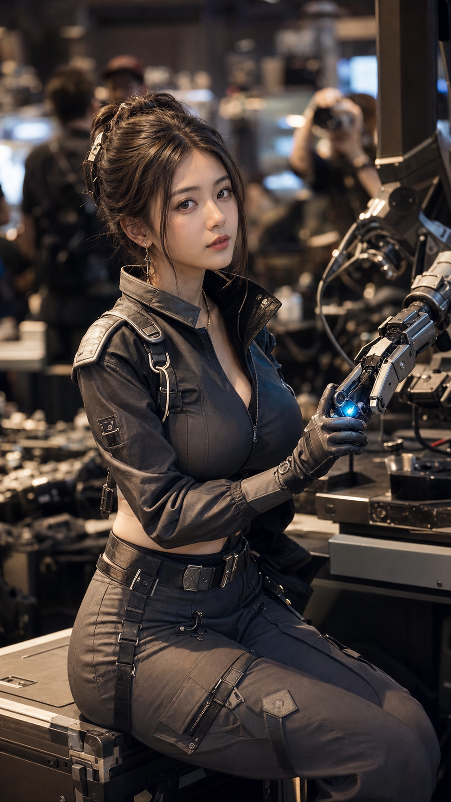
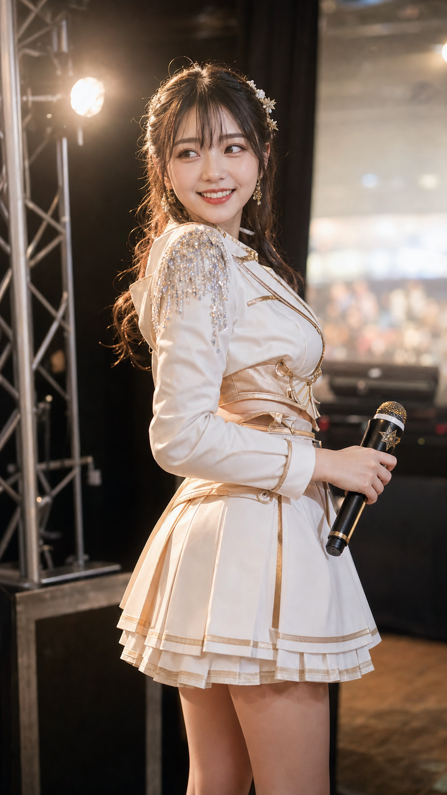

# Cosplay展会摄影 - 官方展台女武神

## 多风格簇验证图

科技未来系 / 机械调律师装备区：



舞台偶像系 / 舞台偶像侧拍：



这两张用于验证同一 `Cosplay展会摄影` 体系下的跨簇差异：角色方向、展馆子空间、服装轮廓、主道具、姿态和镜头都应明显不同，而不是同一套展台写真换颜色。

## 结构化参数

```text
技能: Cosplay展会摄影

角色方向: 女武神
配色: 白金
场景: 大型游戏展馆官方展台，LED主屏，少量摄影师与观众软焦
服装: 白金色结构化战袍，少量金属肩甲，哑光皮革腰封，高级弹力面料
动作: 半靠展示台，低头检查手中的发光长枪道具
人数: 单人
构图: 9比16，大腿以上
生成: 否
```

## 多风格簇参数示例

```text
技能: Cosplay展会摄影

角色方向: 机械调律师
配色: 炭黑 + 暖钢色 + 蓝色接口光
场景: 大型机甲游戏装备展示区，机械臂模型，工具台，少量观众软焦
服装: 炭黑短款机能外套，高腰工装裙裤，哑光金属腰封，薄手套
动作: 坐在装备箱边缘，单手调试机械臂接口，抬眼看向侧前方
人数: 单人
构图: 9比16，大腿以上，50mm中近景
生成: 是
```

```text
技能: Cosplay展会摄影

角色方向: 舞台偶像
配色: 白金 + 香槟金
场景: 官方音乐游戏主舞台侧区，舞台灯阵，音响，远处观众软焦
服装: 白金短款偶像夹克，高腰百褶短裙，少量水晶肩饰，角色麦克风
动作: 刚从舞台走到侧区，握着麦克风回头看同伴
人数: 单人
构图: 9比16，全身到大腿，85mm舞台侧拍
生成: 是
```

## 中文主提示词

```text
Cosplay展会摄影，官方动漫游戏展会摄影，超写实 RAW Photo，Vogue Editorial，Luxury Fashion Campaign，ChinaJoy / Bilibili World / Tokyo Game Show 官方摄影质感。

20-26岁年轻成年东亚女性，小鹅蛋脸，自然骨相，真人摄影感，大眼但不过度动漫化，健康白皙皮肤，真实皮肤纹理，适度自然高光，不网红脸，不AI塑料脸。

身材系统硬锁定：健康丰润，圆润有体积感，肩颈舒展，锁骨柔和，胸部自然饱满但不夸张，腰臀自然过渡，比例协调，腿部修长，高级时尚模特比例但不纸片化。正式覆身不等于宽松遮挡身材，角色服必须通过高级剪裁保留自然胸线、收腰结构、腰臀过渡和女性化曲线。

角色方向为原创女武神，不复刻具体游戏或动漫角色。白金色结构化战袍，少量金属肩甲，哑光皮革腰封，高级弹力面料，服装轮廓清晰，材质统一，贴合但不色情化，曲线表达来自剪裁和姿态，不来自暴露，现代AAA游戏角色宣传图品质。

大型游戏展馆官方展台，LED主屏，官方游戏海报，Booth Logo弱化软焦，少量摄影师与观众作为背景，展馆顶部灯光与柔和轮廓光。她半靠展示台，低头检查手中的发光长枪道具，像官方摄影师抓到的宣传瞬间。

9:16竖构图，大腿以上中景，人物占画面约70%，85mm portrait lens，f/1.8，浅景深，眼平视角，轻微长焦压缩，背景自然虚化，人物永远是第一视觉中心。发光长枪与LED屏边缘光形成唯一角色识别钩子，电影级色彩，Kodak Portra色调，干净低噪点，自然肤色。

物体语义锁定：长枪必须保持为角色武器，不变成链条、灯管、首饰或背景线；Booth Logo必须弱化软焦，不抢主体。
```

## 负面提示词

```text
cheap cosplay, cheap lolita, taobao costume, plastic fabric, excessive lace, too many ruffles, excessive organza, transparent revealing costume, erotic costume, wide angle distortion, fisheye, cluttered convention hall, crowded background, advertising text stealing focus, booth logo too sharp, random crowd blocking subject, AI face, plastic skin, wax skin, over-smoothed skin, influencer filter, same face, duplicate face, duplicate pose, bad anatomy, broken limbs, bad hands, deformed hands, extra fingers, missing fingers, fused fingers, bad feet, distorted legs, prop morphing, weapon turning into chain, LED light on face, scenery inside face, low quality, blurry, overexposed, underexposed, watermark, logo, text
```
