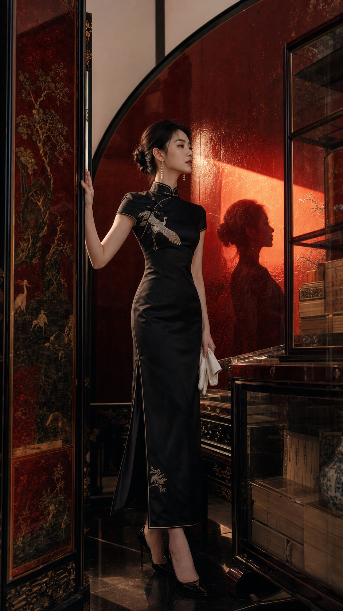
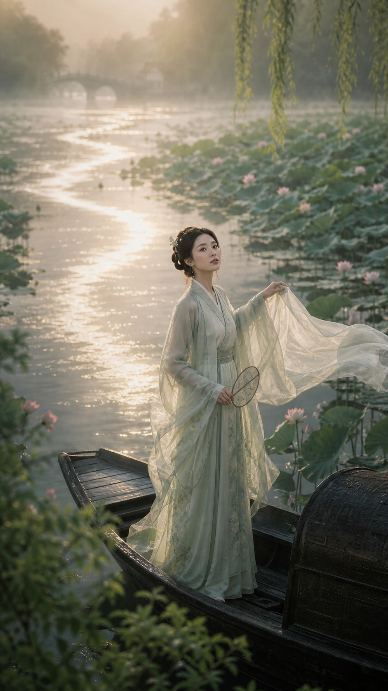
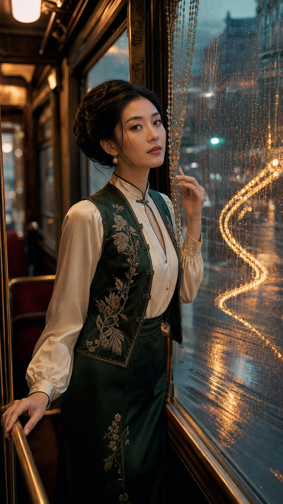
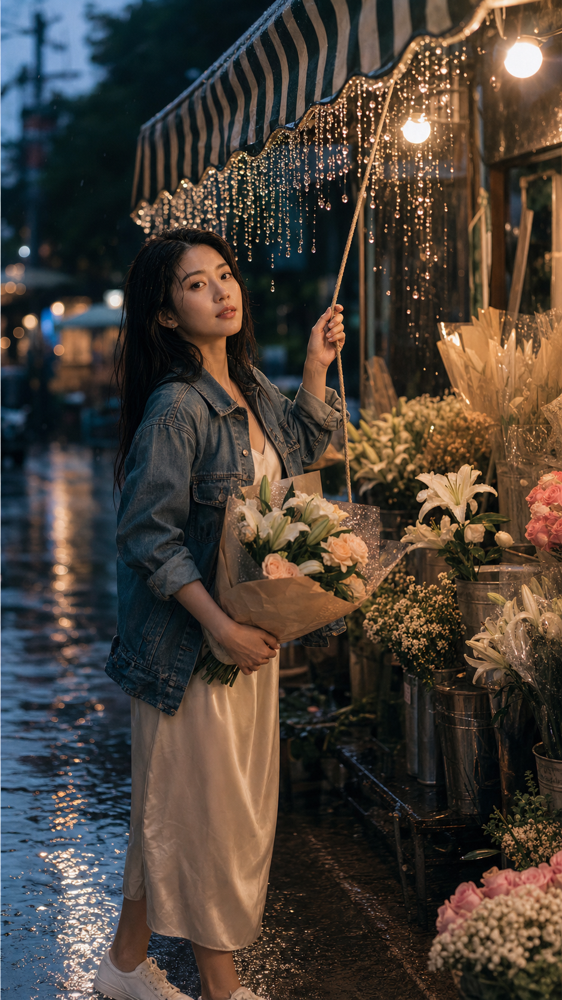

今天这组图继续按照「每日东方美人探索」的固定五图机制推进：1 张原创探索思路种子，4 张从固定风格家族中抽取。目标不是重复单一古风模板，而是在东方幻想、古典、现代、生活感之间持续拉开差异，同时把人物年龄、面部稳定性、道具语义和主体比例都锁死。

今天的五个方向分别是：原创探索的镜漆雨廊、东方幻想古风的天象神朝、古典东方美人的宋韵茶影、现代东方美人的东方静奢、甜系纯欲生活写真的雨后花店回眸。五张图在服装逻辑、人物气质、场景、镜头角度和主道具上都刻意错开。

<!-- more -->

## 今日质量锁定

- 年龄统一：20-26 岁年轻成年东亚女性。
- 主体统一：脸和眼睛第一优先，人物主体占画面 60% 以上。
- 路线分散：同一天不重复同一风格家族、同一场景类型、同一服装逻辑、同一镜头角度和同一主道具。
- 道具语义锁定：杯子、花束、青铜浑仪、书籍等都必须保持原物体语义，不得变成链条、饰品或背景纹样。
- 崩坏规避：禁止景物长进脸里、道具与脸融合、饰品替代杯子、手部和布料粘连、人物和背景融成一团。

## 1. 镜漆雨廊



今天的原创探索思路种子选择了“开放式非常规空间”，并由 GPT 自主命名为「镜漆雨廊」。它不是传统古装、也不是现成赛博模板，而是把东方材料感和雨夜空间结合成一个半现实、半梦境的现代场景。

结构化参数：

```text
技能: 东方美人
风格: 原创探索风格「镜漆雨廊」
探索思路: 非传统空间
年龄: 20-26
气质: 冷静，神秘，年轻，克制
场景: 雨夜高架回廊，黑漆镜面地面，细长灯带，远处湿润城市轮廓被弱化成背景
服装: 墨黑短外套内搭月白缎面长裙，湿润但不贴体，线条利落，东方式极简结构
动作: 她一手稳稳端着黑漆茶杯，一手轻扶回廊立柱，侧身停步后看向镜头
构图: 9比16，大腿以上，轻微仰拍
主视觉钩子: 镜面漆地把灯带和人物倒影折成一道竖向月弧
道具语义锁定: 黑漆茶杯必须是完整杯子，不能变成耳饰、链条、光斑或手指的一部分
生成: 是
```

Prompt 摘要：

```text
9:16 vertical cinematic portrait of a young adult East Asian woman, age 20-26, in an original exploration style named Mirror Lacquer Monsoon. She stands in a rain-soaked elevated corridor with black lacquer mirror flooring and thin linear lights, the distant city reduced to a soft background. She wears a minimal black cropped jacket over a moon-white satin dress with clean Eastern lines. One hand holds a real black lacquer tea cup, the other lightly touches a corridor pillar; she pauses mid-step and turns her eyes toward the viewer. The lacquer floor bends the lights and her reflection into a single crescent-like vertical arc. Face and eyes first, subject dominant over 60 percent, realistic skin texture, clean hands, restrained ornaments, no text.
```

负面提示补充：

```text
scenery inside face, object fused with face, cup turning into chain, jewelry replacing cup, prop morphing, melted cup, reflection replacing the real subject, duplicate girl, extra fingers, fabric fused into hands, background stronger than subject, old-looking face, matronly styling
```

## 2. 天象神朝


这一张来自东方幻想古风路线，重点是“观星神官”这一角色身份和巨大的青铜星环。镜头选择低机位三分之四全身，保证气势和人物主体都成立。

结构化参数：

```text
技能: 东方幻想古风
风格: 天象神朝
年龄: 20-26
气质: 年轻，神性，高贵，清冷
场景: 云海观星台，青铜浑仪，夜空星轨
服装: 月白与深青层叠礼袍，青铜星纹腰饰
动作: 一手扶住青铜浑仪，一手指向星图，回头看向镜头
构图: 9比16，低机位，三分之四全身
主视觉钩子: 巨大的青铜星环在身后形成唯一主视觉
道具语义锁定: 青铜浑仪必须保持完整天文仪器语义，不能变成头饰、链条或背景纹样
生成: 是
```

Prompt 摘要：

```text
9:16 vertical Eastern fantasy key visual. Young adult East Asian woman, age 20-26, as a celestial observatory oracle. She stands on a cloud-sea star platform at night, wearing layered moon-white and deep teal ceremonial robes with bronze star motifs. One hand rests on a real bronze armillary sphere, the other points toward a luminous star chart as she turns her face back to the viewer. A giant bronze ring rises behind her as the single dominant visual hook. Low-angle three-quarter full-body composition, face and eyes remain first priority, subject dominant, premium color harmony, controlled ornament density, no text.
```

负面提示补充：

```text
generic hanfu photoshoot, armillary sphere turning into crown, chain objects, scenery inside face, extra halos, ornament overload, distorted hands, broken instrument, face merged with star map, duplicate subject, plastic skin
```

## 3. 宋韵茶影



这张走古典东方美人路线，刻意把气质拉向温婉、书卷和雨后茶室。镜头只取大腿以上，重点交给脸、茶盏和窗边雨气。

结构化参数：

```text
技能: 古典东方美人
风格: 宋韵茶影
年龄: 20-26
气质: 温婉，清润，书卷气
场景: 雨后茶室，竹帘，青瓷茶盏，窗外湿润庭院
服装: 月白宋风长衫，淡青披帛，白玉簪
动作: 她端起青瓷茶盏，听到脚步声后微微抬眼
构图: 9比16，大腿以上，平视近景
主视觉钩子: 茶汽在窗光里形成一条柔和银线
道具语义锁定: 青瓷茶盏必须是完整杯盏，不能变成链条、花朵、灯具或手部延伸
生成: 是
```

Prompt 摘要：

```text
9:16 vertical classical Eastern beauty portrait. Young adult East Asian woman, age 20-26, gentle and scholarly, inside a rain-washed tea room with bamboo blinds and a damp courtyard beyond the window. She wears a moon-white Song-inspired robe with a pale celadon drape and a white jade hairpin. She lifts a real celadon tea cup and slightly raises her eyes after hearing approaching footsteps. Soft steam becomes a thin silver line in the window light. Thigh-up eye-level composition, face and eyes first, realistic skin, subject over 60 percent, minimal ornaments, no text.
```

负面提示补充：

```text
tea cup turning into flower, cup fused with fingers, steam across face, scenery inside face, old-looking face, overly severe mature styling, messy sleeves, broken hands, duplicate props, muddy background
```

## 4. 东方静奢



现代东方美人方向今天选择“静奢”而不是旗袍电影感，避免和前几天的夜巷类型撞车。整体走暖木、黑石、玉杯和低饱和服装的高端极简路线。

结构化参数：

```text
技能: 现代东方美人
风格: 东方静奢
年龄: 20-26
气质: 优雅，松弛，高级
场景: 暖木酒店廊厅，黑石墙面，一只陶瓷花器作为背景点缀
服装: 黑色真丝上衣，米白阔腿裤，玉扣耳饰
动作: 她一手扶住玉杯，侧身从暖木阴影里看向镜头
构图: 9比16，中景
主视觉钩子: 玉杯边缘的一点青绿高光成为唯一亮点
道具语义锁定: 玉杯必须保持杯子语义，不能变成戒指、耳饰、链条或背景光斑
生成: 是
```

Prompt 摘要：

```text
9:16 vertical modern Eastern beauty editorial. Young adult East Asian woman, age 20-26, elegant and relaxed, standing in a warm wood hotel corridor with black stone walls and a distant ceramic flower vessel kept soft in the background. She wears a black silk top, ivory wide-leg trousers, and small jade-button earrings. She holds a real jade cup with one hand and looks toward the camera from the edge of the warm shadow. A tiny celadon highlight on the cup rim is the single visual hook. Medium-shot composition, clean luxury mood, face and eyes first, subject dominant, realistic skin texture, no text.
```

负面提示补充：

```text
jade cup turning into jewelry, object mutation, chain objects, scenery on face, harsh fashion makeup, plastic skin, extra fingers, cup fused into hand, background overpowering subject, duplicate woman
```

## 5. 雨后花店回眸



最后一张走甜系纯欲生活写真路线，强调真实生活瞬间、恋爱感和自然吸引力。主道具改成花束，镜头是轻抓拍的迎面回眸，和前三张的仪式感、清冷感形成明显反差。

结构化参数：

```text
技能: 甜系纯欲生活写真
风格: 雨后街角花店
年龄: 20-26
人脸风格: 甜系，自然，邻家感
场景: 蓝调时刻街角花店，雨后路面，暖色灯泡
穿搭: 牛仔外套，奶油色吊带长裙，白色球鞋
故事瞬间: 她抱着刚包好的花束，发现你在街对面等她后回头浅笑
构图: 9比16，大腿以上，轻抓拍
主视觉钩子: 花店暖光和雨后冷色街面形成一冷一暖的双层背景
道具语义锁定: 花束必须保持真实花束语义，不能变成头饰、链条、云团或脸部纹样
生成: 是
```

Prompt 摘要：

```text
9:16 vertical candid lifestyle portrait at a rainy street-corner flower shop during blue hour. Young adult East Asian woman, age 20-26, with a sweet natural girlfriend vibe. She wears a washed denim jacket over a cream slip dress and white sneakers. She hugs a freshly wrapped real flower bouquet, notices someone waiting across the street, and turns back with a soft spontaneous smile. Warm flower-shop bulbs contrast with the cool wet street outside. Thigh-up candid framing, face and eyes first, subject over 60 percent, realistic skin, no text.
```

负面提示补充：

```text
flower bouquet turning into hair accessory, flowers fused into skin, bouquet becoming chain, scenery inside face, extra fingers, duplicate person, overexposed skin, childlike styling, background crowd stealing focus
```

## 今日复盘

今天的五张图覆盖了原创探索、东方幻想古风、古典东方美人、现代东方美人、甜系纯欲生活写真五个不同方向。人物年龄、主体比例、面部优先级和道具语义都已经在文字层面锁死，后续真正生图时重点要盯三类问题：杯子和花束的语义是否稳定、雨夜或反光是否侵入脸部、以及现代路线里背景是否抢戏。

如果按自动化继续扩展，下一批适合随机抽到但今天没有使用的家族可以优先考虑：东方美学图鉴、江南现代诗意、敦煌图鉴页、便利店夜色、青瓷月影、莲梦镇邪等，以继续保持风格分散。
