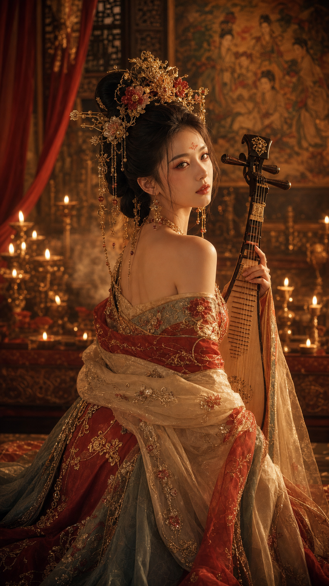

# 唐宫夜宴：成熟妩媚

## 示例图片



## 参数锁定

- 审美系统: `成熟 + 妩媚 + 高贵`
- Route: `tang-palace-night-banquet`
- Subject: adult Chinese Tang palace musician
- Scene: palace night banquet, candle rows, carved screen
- Gesture: holding a pipa and turning back under candlelight
- Palette: cinnabar, antique gold, deep jade, warm amber
- Ratio: 9:16 vertical portrait

## 验证备注

这张图验证的是“妩媚不等于暴露”：核心应来自回眸、眼神、烛光、乐器、珠饰和唐宫华服。当前样张呈现了唐风露肩廓形，后续如需更克制版本，应在提示词里继续强化 `covered shoulders`、`high-collar ceremonial robe` 和 `opaque shawl wrapped over shoulders`。

## Prompt

```text
9:16 vertical Tang palace night banquet portrait, adult Chinese woman, mature restrained allure, noble elegance. She holds a pipa and turns back calmly under candlelight. Tang-inspired ceremonial robe, opaque layered silk, covered shoulders and covered chest, embroidered shawl wrapped over arms, cinnabar, antique gold, deep jade, flower crown, gold hairpins. Carved palace screens, candle rows, silk curtains, mural background, incense haze. Beauty through gaze, posture, jewelry, fabric weight, warm amber candlelight, gold rim light, deep red shadows. Cinematic three-quarter portrait, subject dominant, refined classical Eastern aesthetics. No text.
```

## Negative Prompt

```text
underage, exposed shoulders, exposed chest, revealing fabric, lingerie, erotic pose, cheap cosplay, plastic skin, bad hands, extra fingers, watermark, text
```
