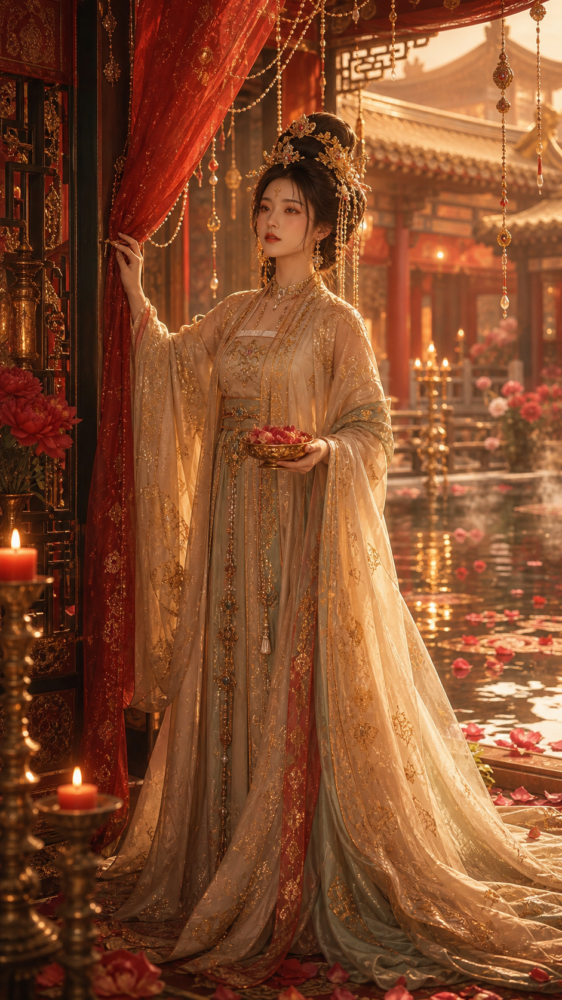

# 唐宫花泉仪式：高贵柔美

## 示例图片



## 参数锁定

- 技能: `古典东方美人`
- 风格: `唐宫花泉仪式`
- 审美系统: `高贵大气 + 柔美`
- Route: `tang-palace-night-banquet` with palace flower-spring ritual accent
- Subject: adult Chinese Tang palace noblewoman
- Scene: red-gold Tang palace flower-spring courtyard, reflective pond,
  red silk curtain, candle stands, incense haze
- Costume: pale gold and warm jade-white Tang-inspired ceremonial robe,
  opaque layered silk, ornate gold embroidery
- Gesture: one hand holding the red silk curtain, one hand holding a small
  golden bowl of peony petals
- Palette: cinnabar red, antique gold, warm jade white, candle amber
- Ratio: 9:16 vertical full-body portrait

## 导演设定

这张图适合作为“唐宫花泉仪式”的安全示例：保留花泉、花瓣、香雾、烛光、唐宫高贵感和柔美气质，
但把容易触发风险的“洗浴”改成“池畔献花仪式”。人物保持完整覆身礼服，
吸引力来自礼服层次、珠冠、红金帷幔、池水倒影和温柔注视，而不是暴露。

## Prompt

```text
9:16 vertical full-body classical Eastern beauty portrait, 唐宫花泉仪式, adult Chinese Tang palace noblewoman, noble and graceful, soft feminine dignity. She stands beside a reflective palace flower-spring pond in a red-gold Tang-inspired courtyard, one hand gently holding a red silk curtain, the other holding a small golden bowl filled with peony petals. Pale gold and warm jade-white Tang-inspired ceremonial robe, opaque layered silk, flowing wide sleeves, ornate gold embroidery, delicate waist sash, pearl and gold hair ornaments, flower crown, jade hairpin. Red silk curtains, hanging jewel chains, carved lacquer door, bronze candle stands, incense haze, peony flowers, floating petals on reflective water, distant palace roof and warm lanterns. Warm candlelight, soft gold rim light, amber haze, cinematic classical Eastern beauty, refined palace ritual atmosphere, detailed fabric texture, natural skin texture, elegant hands, clean composition, subject dominant, no text.
```

## Negative Prompt

```text
underage, nudity, exposed chest, transparent revealing fabric, lingerie, erotic pose, bath voyeurism, wet revealing clothes, foot-focused framing, cheap cosplay, plastic skin, bad hands, extra fingers, distorted face, watermark, text
```
