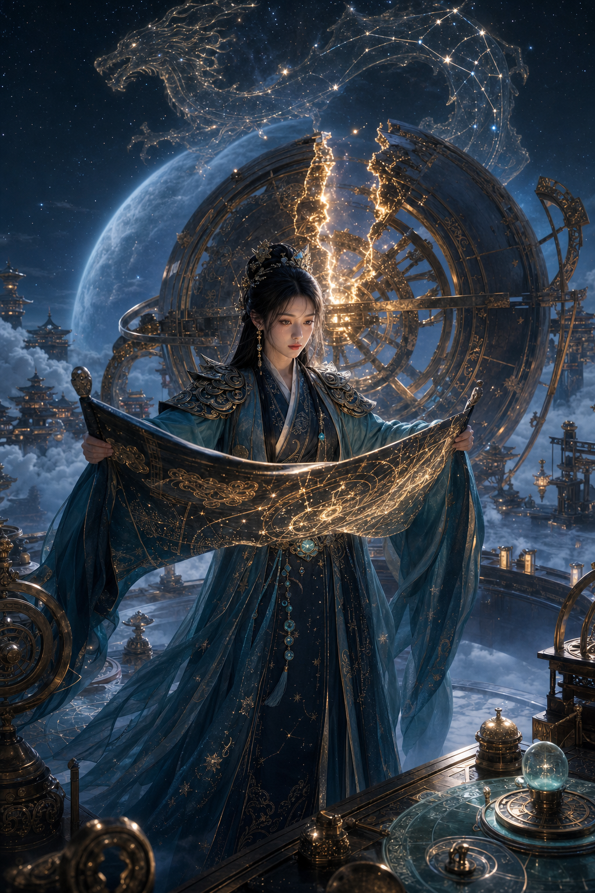

# Celestial Empire: Star Priestess

## 示例图片



## Parameter Lock

- Route: `celestial-empire`
- Subject: adult Eastern fantasy Chinese heroine
- Face temperament: cold-and-clear, sacred-and-remote
- Body language: slender-and-tall, ritual-composure
- Prop: jade astrolabe, bronze armillary sphere
- Scene: floating observatory above cloud sea
- Palette: deep teal, antique gold, moon silver
- Ratio: 2:3 vertical key visual

## Director Setting

An adult celestial cartographer-priestess opens a forbidden star map on a floating observatory above a cloud sea. Her jade astrolabe projects a dragon-shaped constellation, making her feel like a keeper of imperial fate rather than a generic beauty portrait.

## Module Analysis

Character: cold phoenix eyes, thin brows, calm lips, direct but remote gaze toward the star map.

Costume and artifact: dark teal ceremonial hanfu armor, gold cloud-shoulder plates, constellation embroidery, jade waist ornaments, rotating astrolabe as the plot-driving artifact.

Scene and spectacle: bronze armillary sphere behind her, cloud sea below, distant celestial palace silhouettes, talisman fragments orbiting in slow arcs.

Camera and lighting: low-angle three-quarter full-body key visual, astrolabe as halo framing, moon-blue ambient light, warm golden starlight on face and sleeves.

## Chinese Prompt

```text
生成一张2:3竖版东方幻想古风美女主视觉。成年东方幻想女子，天象神朝的星图神官，正在云海观星台上开启禁忌星图，清冷凤眼，细眉，神性而疏离的神态，修长挺拔的身形，仪式感站姿，视线专注于空中旋转的龙形星图，一手拨动玉制星盘，
一手牵引金色星光。高云髻配金玉天文冠与珍珠垂链，朱砂眼尾，身着深青色祭仪汉服铠，象牙白内衬，鎏金云肩，星宿刺绣，黑漆腰封与玉佩。置身漂浮在云海之上的青铜观星台，巨大的浑天仪在身后形成光环构图，远处有天宫剪影，
符箓碎片缓慢环绕。月蓝环境光与星盘金光交织，低角度三分之二全身构图，强剪影，深青、古金、月银配色，真实丝绸与金属纹理，东方幻想系列主视觉，电影级光影，高级国风审美，画面干净，无文字。
```

## English Prompt

```text
vertical 2:3 premium Eastern fantasy key visual, adult Chinese celestial cartographer-priestess opening a
forbidden star map on a floating observatory above a sea of clouds, cold phoenix eyes, thin brows, sacred
remote expression, tall slender silhouette, ritual composure, focused gaze toward a dragon-shaped
constellation map, one hand turning a jade astrolabe and the other guiding golden starlight, high cloud bun,
gold and jade astronomical crown, pearl chains, cinnabar eye makeup, dark teal ceremonial fantasy hanfu
armor, ivory inner layers, antique gold cloud-shoulder plates, constellation embroidery, black lacquer belt,
jade ornaments, enormous bronze armillary sphere behind her as a halo, distant celestial palaces, orbiting
talisman fragments, moon-blue ambient light, warm golden starlight illuminating her face and sleeves,
low-angle three-quarter full-body composition, strong silhouette, deep teal, antique gold, moon silver
palette, realistic silk and metal texture, refined Chinese fantasy art direction, no text
```

## Negative Prompt

```text
low quality, low resolution, blurry, watermark, text, logo, bad anatomy, bad hands, extra fingers, missing
fingers, fused fingers, distorted face, plastic skin, over-smoothed skin, generic hanfu photoshoot, cheap
cosplay, modern clothing, zipper, sneakers, phone, western medieval armor, japanese shrine, korean hanbok,
random cyberpunk neon, messy background, oversaturated colors, duplicate person
```
