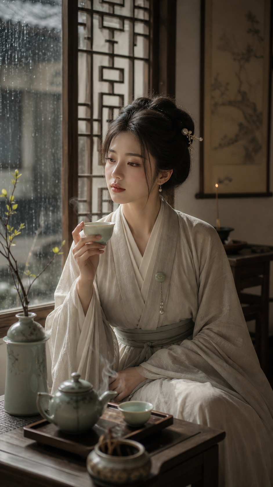

# 宋韵茶影：温婉优雅

## 示例图片



## 参数锁定

- 审美系统: `温婉 + 优雅`
- Route: `song-tea-shadow`
- Subject: adult Chinese classical beauty
- Scene: Song-inspired tea room, rainy lattice window
- Gesture: pausing before lifting a celadon teacup
- Palette: ivory, warm gray, pale jade, moss green
- Ratio: 9:16 vertical portrait

## 导演设定

宋韵茶影强调温柔、克制和留白。画面吸引力来自雨窗、茶气、宋式衣料线条、安静眼神和手中茶杯，而不是宏大奇观。

## Prompt

```text
9:16 vertical classical Eastern beauty portrait, 宋韵茶影, 温婉优雅. Adult Chinese woman in a quiet Song-inspired tea room, gentle gaze, composed posture, graceful shoulder-neck line, natural skin texture. She sits beside a low wooden tea table near a lattice window, pausing before lifting a celadon teacup. Pale ivory and warm gray cross-collar Song-inspired robe, opaque layered silk, small jade button, simple pearl hairpin. White wall, dark wood lattice window, rain outside, tea steam, ceramic cup, incense thread, single branch in a vase. Soft rainy window light, tea steam highlight, calm shadow, ivory, warm gray, pale jade, moss green palette, cinematic 85mm lens, thigh-up framing, subject dominant, refined classical Eastern aesthetics, quiet poetry. No text, no watermark.
```

## Negative Prompt

```text
underage, revealing fabric, lingerie, cheap costume, fantasy magic, clutter, plastic skin, bad hands, extra fingers, distorted face, watermark, text
```
