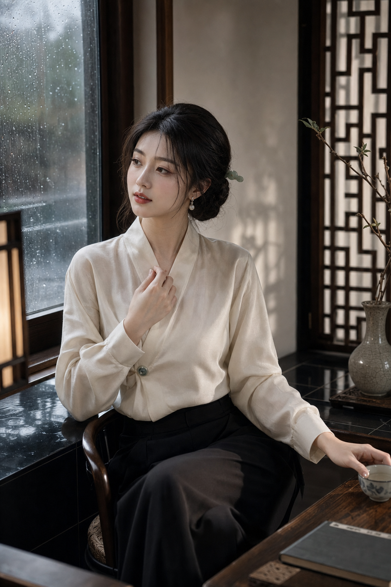

# 新中式杂志：雨窗美人

## 示例图片



## Parameter Lock

- Route: `new-chinese-editorial`
- Subject: adult modern Eastern beauty
- Face temperament: calm, refined, intelligent, slightly distant
- Styling: new-Chinese fashion editorial
- Wardrobe: ivory cross-collar silk blouse, black wide-leg trousers, jade button accents
- Scene: rainy Jiangnan-inspired modern interior
- Visual hook: rain-streaked window reflection doubling the face while lattice shadows frame her silhouette
- Palette: ivory, ink black, rain gray, moss green, small cinnabar lip accent
- Ratio: 2:3 vertical magazine cover portrait

## Director Setting

An adult Eastern woman appears in a restrained new-Chinese fashion editorial. The image should feel modern, refined, and real, with the attraction coming from facial temperament, tailoring, rain light, and a quiet hand gesture rather than fantasy spectacle or body exposure.

## Module Analysis

Character: lean classical face, calm almond eyes, soft natural brows, muted red lips, natural skin texture, composed expression with slight distance.

Wardrobe: ivory cross-collar silk blouse with clean structure, black high-waisted wide-leg trousers, small jade button and pearl earring accents, modern tailoring with subtle classical cues.

Scene: modern tea-room interior, rainy window, white wall and black tile reflection outside, dark wood table, single ceramic cup, moss-green branch in a vase.

Camera and light: 85mm vertical portrait, three-quarter seated composition, face and hands crisp, soft rainy window light, thin lattice shadow across background, restrained magazine retouching.

## Chinese Prompt

```text
生成一张2:3竖版新中式杂志封面人像。成年东方女性，现代东方高级感妆造，清冷知性、安静疏离的脸部气质，古典偏清瘦脸型，平静杏眼，柔和自然眉，克制的朱红唇色，真实自然皮肤质感，不过度磨皮。她坐在雨天的现代茶室窗边，
脖颈挺直，肩膀放松，身体微微侧转，视线越过镜头看向窗外，一手轻触交领衣襟上的玉扣，另一手扶着深色木桌边缘，手部优雅自然。身着象牙白新中式交领丝质上衣，结构干净，黑色高腰阔腿长裤，小颗玉扣与珍珠耳饰作为细节，
现代剪裁融合东方衣领逻辑，不像戏服。场景为克制的江南灵感现代室内，雨痕玻璃窗、窗外白墙黑瓦倒影、深色木桌、单只陶瓷茶杯、苔绿色枝条花器，空间干净有层次。视觉钩子：雨窗反射出她若隐若现的侧脸，与真实面孔形成双重凝视，
细窄木格阴影在背景形成东方几何框景。85mm人像镜头，三分之二坐姿构图，脸部、手、衣料纹理清晰，柔和雨天窗光为主光，少量冷灰环境光，象牙白、墨黑、雨灰、苔绿、朱红点缀，高级东方审美，时尚杂志质感，真实克制，画面干净，
无文字。
```

## English Prompt

```text
vertical 2:3 modern new-Chinese fashion editorial portrait, adult Eastern woman with calm refined intelligent
presence and slight emotional distance, lean classical face, calm almond eyes, soft natural brows, muted
cinnabar red lips, natural skin texture, no heavy beauty filter, seated beside a rainy window in a modern
tea-room interior, straight neck, relaxed shoulders, slight three-quarter turn, gaze looking past the camera
toward the window, one hand touching the jade button on her cross-collar blouse, the other hand resting on a
dark wooden table edge, graceful natural hands, ivory new-Chinese cross-collar silk blouse with clean
structure, black high-waisted wide-leg trousers, small jade buttons and pearl earrings, modern tailoring with
subtle Eastern collar logic, not costume-like, restrained Jiangnan-inspired modern interior, rain-streaked
glass, reflection of white walls and black roof tiles outside, dark wood table, single ceramic teacup,
moss-green branch in a vase, strong visual hook: rainy window reflection faintly doubles her side profile,
creating a quiet double gaze, narrow wooden lattice shadows forming an Eastern geometric frame behind her,
85mm portrait lens, two-thirds seated composition, crisp face, hands, and fabric texture, soft rainy window
light, cool gray ambient light, ivory, ink black, rain gray, moss green, small cinnabar accent, premium
modern Eastern aesthetics, magazine cover quality, refined realistic retouching, clean image, no text
```

## Negative Prompt

```text
underage, age-ambiguous, sexualized pose, revealing transparent clothing, lingerie, cheap cosplay, costume
hanfu, plastic skin, over-smoothed skin, heavy beauty filter, bad anatomy, bad hands, extra fingers, missing
fingers, distorted face, messy background, clutter, neon cyberpunk, random fantasy magic, low quality, low
resolution, watermark, text, logo
```
